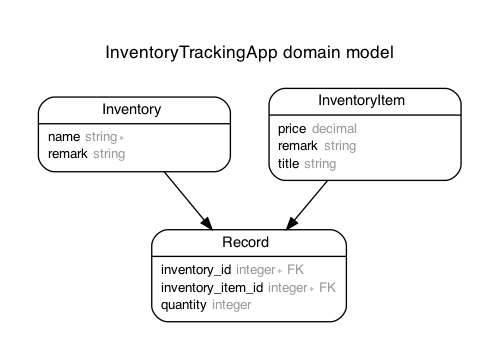
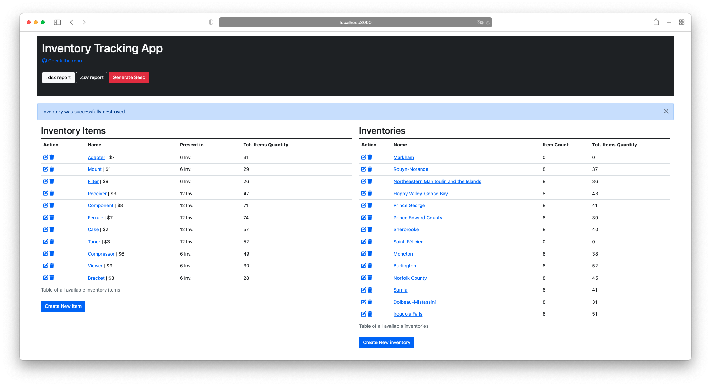
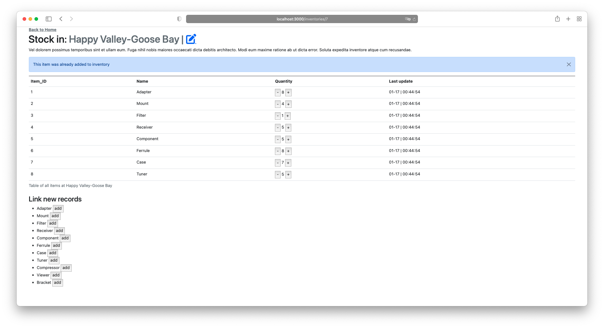
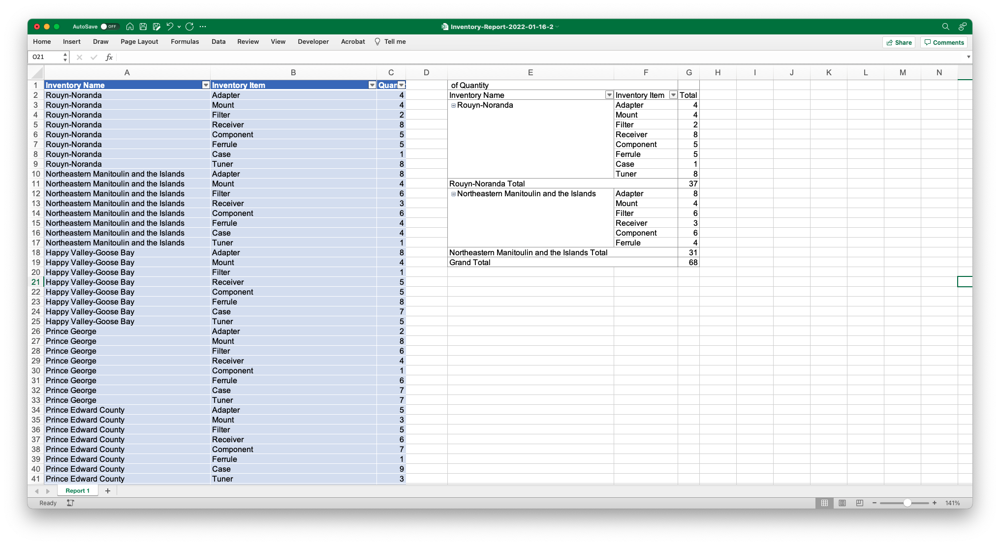
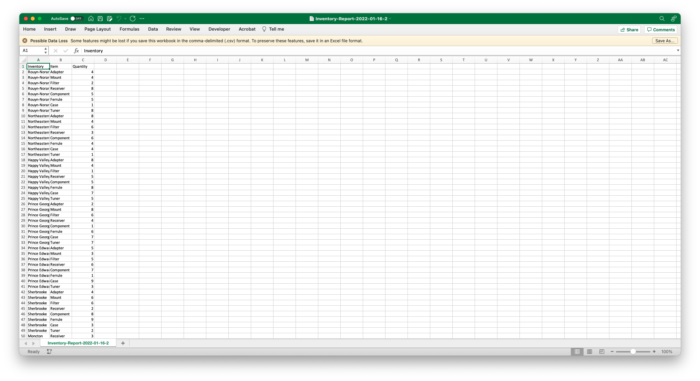

# README
## About
Inventory tracking app that allow you to create inventory and inventory items and to asign inventory item to inventory.

**Application was published on https://inventory-tracking-2022.herokuapp.com/**

Feature: 

1. Generate report with one click that shows inventory status with graph
3. Generate detailled report in .xlsx with pivot table for analysis
2. Bulk export csv 
3. View inventory and inventory item 
4. Create, read, update, delete inventory and inventory items
5. API endpoints return ``` json ```

# Configuration
* Ruby Version: 3.0
* Rails Version: 7.0.1 (on the Edge)

## How to install
- Install Ruby ~ [Link to ruby download page](https://www.ruby-lang.org/en/downloads/)
    - Make sure that ruby was succesfully installed by running 
    ```$ ruby -v```
    - You should expect ``` ruby 3.0.XX ...```
- Pull the project from github
- Enter the project directory locally
- Install the dependencies by running ``` bundle install ```
- Create the database ```rake db:create```
- Run the migrations ```rake db:migrate``` 


## General note
- Using Postgres as DB for this project, if you dont have pg please download it here [download postGres](https://www.postgresql.org/download/).
- Hosting is on **Heroku**

* ...

## Testing command
 

> ``` rails test ```

## Linting command

For linting, I am using rubocop via the bundler
> ``` bundle exec rubocop ```

## ERD
Generate Entity-Relationship Diagrams for the app by running
> ``` bundle exec erd ```



# Endpoints
"Production" environment [^1]

"local" environement : http://localhost:3000 (or another PORT)


| Type          | Endpoint |        Body | What it does |
| -----------:  | :----------- | :----------- | :----------- |
| GET        | /inventories       |    | Return list of all inventories
| POST       | /inventories        | { "name"*,  "remark" }   | Create an inventory item and return that inventory
| GET        | /inventories?id       |    | Return inventory of {id}
| PUT        | /inventories?id       |    | Edit inventory with {id}
| DELETE     | /inventories-items?id       |    | Delete inventory with {id}
|      |       |    |
| GET        | /inventory_items       |    | Return list of all inventory-items
| POST       | /inventory_items        | { "title"*,  price, "remark" }   | Create an inventory item and return that inventory
| GET        | /inventory_items?id       |    | Return inventory-items of {id}
| PUT        | /inventory_items?id       |    | Edit inventory-items with {id}
| DELETE     | /inventory_items?id       |    | Delete inventory-items with {id}
|      |       |    |
| GET        | /inventories/report.csv       |    | Generate .CSV report 
| GET        | /inventories/report.xlsx       |    | Generate .xlsx report 
| POST        | /inventories/id/increment       | {inventory_item_id*, count }   | Increase Inventory item in inventory 
| POST        | /inventory_items/id/increment       | {inventory_id*, count }   | Increase inventory in Inventory item


[^1]: The environment that was setup on [https://inventory-tracking-2022.herokuapp.com/] 


## Screenshot of the frontend

Built using erb





